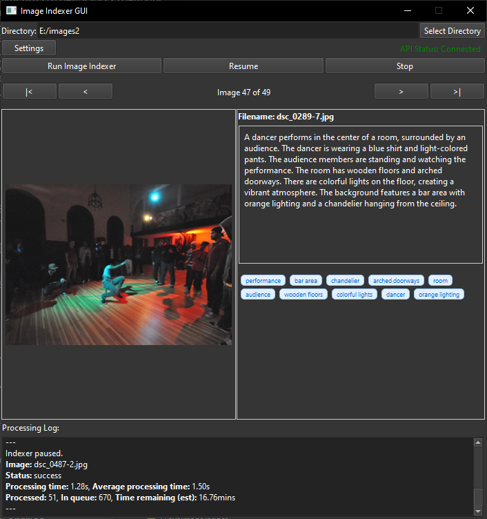

# LLMII: Locally Label Metadata and Index Images

LLMII uses a local AI to label metadata and index images. It does not rely on a cloud service or database.

A visual language model runs on your computer and is used to create captions and keywords for images in a directory tree. The generated information is then added to each image file's metadata or to a sidecar file. The images can then be indexed, searched, and organized by by their descriptions using any tool you like that can access the common metadata fields. The files themselves are not bound to any location or tied to any software and the indexer can be run any number of times on the same collection in order to add more metadata or process new images. 

The first time you launch the tool you will be presented with a list of AI models to choose from. Once the model weights are downloaded and the dependencies are installed then the tool and all of its components will operate locally.
  


## Features
 
- **Image Analysis**: Utilizes a local AI model to generate a list of keywords and a caption for each image
- **Metadata Enhancement**: Can automatically edit image metadata with generated tags
- **Local Processing**: All processing is done locally on your machine
- **Multi-Format Support**: Handles a wide range of image formats, including all major raw camera files
- **User-Friendly GUI**: Includes a GUI and installer. Relies on Koboldcpp, a single executable, for all AI functionality
- **Image View**: View images step through them to review the metadata generation after they are processed
- **Simple Model Selection**: Choose a the state of the art model and it will be automatically downloaded and configured
- **Completely Automatic Backend Configuration**: The AI backend (KoboldCpp) will be downloaded and configured with optimal settings  
- **GPU Acceleration**: Will use Apple Metal, Nvidia CUDA, or AMD (Vulkan) hardware if available to greatly speed inference
- **Cross-Platform**: Supports Windows, macOS ARM, and Linux
- **Stop and Start Capability**: Can stop and start without having to reprocess all the files again
- **One or Two Step Processing**: Can do keywords and a simple caption in one step, or keywords and a detailed caption in two steps 
- **Highly Configurable**: You are in control of everything
- **Multiple Models**: You can choose a different model and run it again for additional keywords 

## Important Information

It is recommended to have a discrete graphics processor in your machine.

This tool operates directly on image file metadata. It will write to one or more of the following fields:

  1. MWG:Keyword
  2. MWG:Description
  3. XMP:Identifier
  4. XMP:Status
  
The "Status" and "Identifier" fields are used to track the processing state of images. The "Description" field is used for the image caption, and "Subject" or "Keyword" fields are used to hold keywords.

**The use of the Identifier tag means you can manage your files and add new files, and run the tool as many times as you like without worrying about reprocessing the files that were previously keyworded by the tool.**
     
## Installation

### Prerequisites

- Python 3.8 or higher
  
### Windows Installation

1. Clone the repository or download the [ZIP file](https://github.com/jabberjabberjabber/ImageIndexer/archive/refs/heads/main.zip) and extract it

2. Install [Python for Windows](https://www.python.org/downloads/windows/)

3. Run `llmii-windows.bat`

### macOS Installation (including ARM)

1. Clone the repository or download the [ZIP file](https://github.com/jabberjabberjabber/ImageIndexer/archive/refs/heads/main.zip) and extract it

2. Install Python 3.7 or higher if not already installed. You can use Homebrew:
   ```
   brew install python
   ```

3. Install ExifTool:
   ```
   brew install exiftool
   ```

4. Run the script:
   ```
   ./llmii.sh
   ```
   
5. If KoboldCpp fails to run, open a terminal in the 'resources' folder:
   ```
   xattr -cr ./resources/koboldcpp-mac-arm64
   chmod +x ./resources/koboldcpp-mac-arm64
   ```

### Linux Installation

1. Clone the repository or download and extract the ZIP file

2. Install Python 3.8 or higher if not already installed. Use your distribution's package manager, for example on Ubuntu:
   ```
   sudo apt-get update
   sudo apt-get install python3 python3-pip
   ```

3. Install ExifTool. On Ubuntu:
   ```
   sudo apt-get install libimage-exiftool-perl
   ```

4. Run the script:
   ```
   ./llmii.sh
   ```

5. If KoboldCpp fails to run, open a terminal in the 'resources' folder:
   ```
   chmod +x ./resources/koboldcpp-linux-x64
   ```

## Usage

1. Launch the LLMII GUI:
   - On Windows: Run `llmii-windows.bat`
   - On macOS/Linux: Run `./llmii.sh`

2. Ensure KoboldCPP is running. Wait until you see the following message in the KoboldCPP window:
   ```
   Please connect to custom endpoint at http://localhost:5001
   ```

3. Configure the indexing settings in the GUI

4. Click "Run Image Indexer" to start the process

5. Monitor the progress in the output area of the GUI.

## Languages

It is sometimes possible to get keywords or captions in a language besides English. You will need to modify the instruction and uncheck some keyword options. To do this:

1. In the GUI, click on "Settings" and then "Edit Instructions":
   - Replace ENGLISH in the instructions with the name of a different language

2. In Keyword Corrections:
   - Uncheck "Depluralize keywords"
   - Uncheck "Only Latin characters"

## Settings

### API Settings

**API URL:** URL of the LLM API server. Default is `http://localhost:5001`

**API Password:** Password for API authentication if required. Leave blank if no authentication needed.

### Instruction Settings

**System Instruction:** The instruction given to guide the LLM's behavior. 

**Edit Instruction:** Opens dialog to edit detailed instructions for image analysis.

### Directory Setting

**Skip Folders:** list folders here that you want to skip entirely. Separate by a new line or a semicolon. You don't have to put the full path -- the subdirectory name only will suffice.

### Caption Options

**Caption Instruction:** Specific instructions for generating a detailed image caption.

**Separate caption query:** Send a separate query for captions and keywords This will take twice as long. Uses the Caption instruction and Keyword instruction.

**Combined caption query:** Generate captions and keywords in one query. This uses the main instruction. *Recommended setting*

**No caption query:** Skip caption generation entirely, only create keywords. This uses the Keyword instruction.

### Generation Options

**GenTokens:** Maximum number of tokens to generate in response. These are tokens, not words. Fewer tokens means faster processing per generation but may lead to more retries because the model may get cut off mid generation. More is not necessarily better though. *Recommended setting for separate captions or keywords is between 100 and 200, for combined caption and keywords between 200 and 300*

### Image Options

**Dimension length:** The maximum length of a horizontal or vertical dimension of the image, in pixels. Setting this higher will not necessarily result in better generations. *Recommended setting is between 392 and 896*

### Sampler Options

Samplers affect the tokens that the AI can choose from every time it generates a new token.

**Temperature:** The randomness of the model output. Between 0.0 and 2.0 *Recommended setting is between 0.1 and 0.5*

**top_p:** Chooses from the smallest set of tokens which have a probability exceeding p. Off = 1.0 *Recommended setting is between 0.92 and 1*

**top_k:** Limits to the most likely k tokens. Off = 0 *Recommended setting is between 20 and 100* 

**min_p:** Blocks tokens with probability lower than p. Off = 0.0 *Recommended setting is between 0.02 and 0.05*

**rep_pen:** Prevents repetition. May cause erratic behavior. Off = 1.0 *Recommended setting is between 1.0 and 1.02*

### File Options

**Don't go in subdirectories:** Only process images in the main directory, don't look inside others.

**Reprocess everything:** Process all images, even if they already have metadata. If you check this and leave *Don't clear existing keywords* unchecked it will remove all existing keywords from any previously processed files and replace them with the new generations.

**Reprocess failures:** Reprocess images that were marked as failed in previous runs.

**Fix any orphans:** *Decrecated setting* When a file gets processed it gets some metadata added to it so that the tool knows it has been processed and what the state of the last processing was. If we find images with what looks like valid metadata that was processed by the tool, but the status markers are missing, we call these orphans. This option will add the status marker to the orphans without regenerating the metadata. Without this checked then files which were produced with versions of the tool before the removal of the need for the json database will be processed again as new files. With this checked then if there is bad metadata in images that looks valid to the tool, it will mark those files as a success. It is recommended to use this option only if you have used previous versions of this tool before March 2025 and are running on those files again.

**No backups:** Don't create backups of existing metadata before modifying. By default there will be a file created with an `_original` label for each altered image, so if you don't want that then check this box.

**Pretend mode:** Simulate processing without making any changes.

**No file validation:** If checked, files will not be checked for metadata errors.

**No retries:** If a generation fails a second attempt will occur unless this box is checked.

**Use metadata sidecar instead of writing to image:** If you do not want to write anything to the image files themselves, for instance if you have hashed the files and they cannot change, you can instead write the metadata to an xmp file with the same name as the image file but with an xmp extension added. This xmp file will contain the metadata.

### Existing Metadata

**Don't clear existing keywords:** Checking this box will add the newly generated keywords to any existing keywords in the metadata. This option is useful for running the generations again with a new model or a new prompt along with *Reprocess all* to add try and fill them out. Will not add duplicates.  

**Don't clear existing caption:** Keep existing caption and add new text with tags. Checking this will add the generated caption onto an existing caption surrounded by XML tags.

### Keyword Corrections

These options determine how the keywords are handled after the AI generates them.

**Depluralize keywords:** Convert plural keywords to singular form. May strip the last *s* off the end of some words.

**Limit to N words:** Limit keywords to specified number of words each.

**Split 'and'/'or' entries:** Break *and* / *or* phrases into separate keywords unless they are in a list of exceptions like 'rock and roll'.

**Ban prompt word repetitions:** AIs really like to repeat words back from the prompt if they aren't feeling very creative. Checking this option will refuse to add words that are in the instructions which commonly get repeated.

**Cannot start with 3+ digits:** Filter out keywords starting with 3+ digits. *3d video* would be fine but *2024 summer* would be rejected.

**Words must be 2+ characters:** Require words to be at least 2 characters long unless they are *x* or *u*.

**Only Latin characters:** Remove keywords with non-Latin characters.
   
## More Information and Troubleshooting

Consult [the wiki](https://github.com/jabberjabberjabber/ImageIndexer/wiki) for detailed information.

## Contributing

Contributions are welcome! Please feel free to submit a Pull Request.

## License

This project is licensed under the GPLv3 License - see the LICENSE file for details.

## Acknowledgements

- [ExifTool](https://exiftool.org/) for metadata manipulation
- [KoboldCPP](https://github.com/LostRuins/koboldcpp) for local AI processing and for the GPU information logic
- [PyQt6](https://www.riverbankcomputing.com/software/pyqt/) for the GUI framework
- [Fix Busted JSON](https://github.com/Qarj/fix-busted-json) and [Json Repair](https://github.com/josdejong/jsonrepair) for help with mangled JSON parsing
